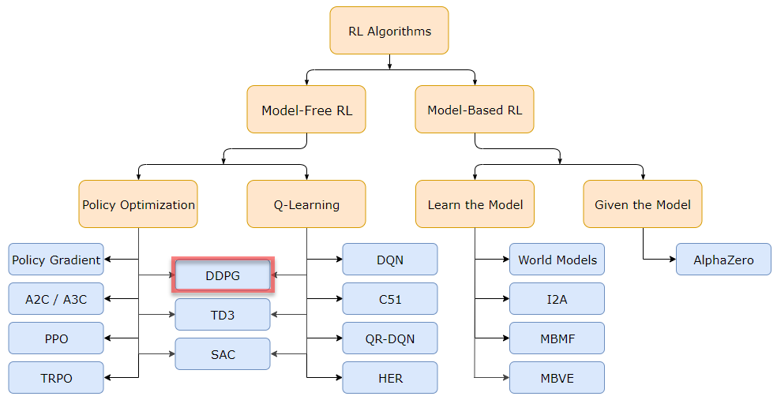
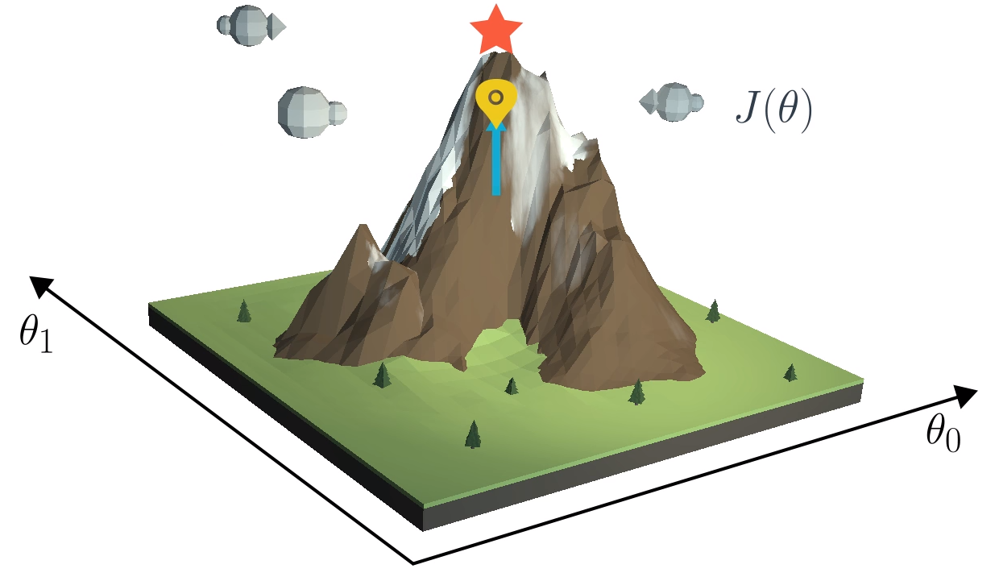
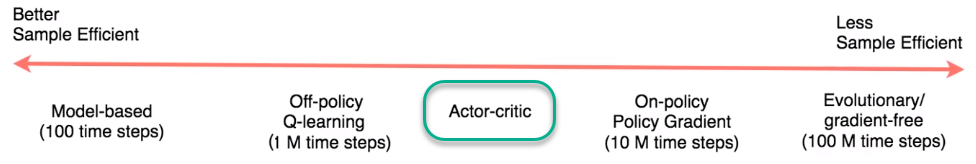

# Multi-Agent Collaboration and Competition | RL Agents Play Tennis
##### &nbsp;

> [Figure 1:](https://github.com/Unity-Technologies/ml-agents/blob/master/docs/images/tennis.png?raw=true) _Agents Playing Tennis_

## Goal

The goal of this project is to train two RL agents to play tennis in a competitive manner. The goal of each player is to keep the ball in play as long as possible to get more rewards. The players may hit the ball back and forth over the net for long periods if they are trained almost equally.

##### &nbsp;
## The Environment


For this project, you will work with the [Tennis](https://github.com/Unity-Technologies/ml-agents/blob/master/docs/Learning-Environment-Examples.md?fireglass_rsn=true#tennis&fireglass_params|&clear_tab_id=true&anti_bot_permission) environment.

In this environment, two agents control rackets to bounce a ball over a net. If an agent hits the ball over the net, it receives a reward of +0.1. If an agent lets a ball hit the ground or hits the ball out of bounds, it receives a reward of -0.01. Thus, the goal of each agent is to keep the ball in play.
The observation space consists of 8 variables corresponding to the position and velocity of the ball and racket. Each agent receives its own, local observation. Two continuous actions are available, corresponding to movement toward (or away from) the net, and jumping.
The task is episodic, and in order to solve the environment, your agents must get an average score of +0.5 (over 100 consecutive episodes, after taking the maximum over both agents). Specifically,
 - After each episode, we add up the rewards that each agent received (without discounting), to get a score for each agent. This yields 2 (potentially different) scores. We then take the maximum of these 2 scores.
 - This yields a single **score** for each episode.

The environment is considered solved, when the average (over 100 episodes) of those scores is at least +0.5.

**Note**: The project environment is similar to, but not identical to the Tennis environment on the [Unity ML-Agents GitHub page](https://github.com/Unity-Technologies/ml-agents/blob/master/docs/Learning-Environment-Examples.md?fireglass_rsn=true#fireglass_params|&clear_tab_id=true&anti_bot_permission).

##### &nbsp;
## The State and Action Spaces

```python
Number of agents: 2
Size of each action: 2
There are 2 agents. Each observes a state with length: 24
The state for the first agent looks like: [ 0.          0.          0.          0.          0.          0.          0.
  0.          0.          0.          0.          0.          0.          0.
  0.          0.         -6.65278625 -1.5        -0.          0.
  6.83172083  6.         -0.          0.        ]
```
##### &nbsp;


## Reinforcement Learning Methods


[3 Types of Reinforcement Learning are shown below:](https://youtu.be/zR11FLZ-O9M?t=1885)


| Model-Based  | Value-Based | Policy-Based |
| ------------- | ------------- | ------------- |
| Learn the model of the world, then plan using the model |Learn the state or state-action value | Learn the stochastic policy function that maps state to action |
| Update model often | Act by choosing best action in state   | Act by sampling policy |
| Re-plan often  | Exploration is a necessary add-on  | Exploration is baked in |


##### &nbsp;


## Multi-Agent Deep Deterministic Policy Gradient (MADDPG)

I used the DDPG algorithm as a base - which is explained in **_Continuous Control with Deep Reinforcement Learning_** [paper](https://arxiv.org/pdf/1509.02971.pdf) by **Google Deepmind** - to implement MADDPG algorithm and hence to solve the environment. This is _a model-free, off-policy actor-critic algorithm using deep function approximators that can learn policies in high-dimensional, continuous action spaces_. This is an extension of Deep Q-learning specialized for continuous tasks. A [single-agent DDPG implementation](https://github.com/udacity/deep-reinforcement-learning/tree/master/ddpg-pendulum) to solve OpenAI Gym's Pendulum environment is used as a base point to start my implementation.

Further details about vanilla DDPG algorithm are outlined in the following sub-sections;


### _Deep Deterministic Policy Gradient (DDPG)_
The algorithm implemented to solve this environment is [_Deep Deterministic Policy Gradient_](https://arxiv.org/pdf/1509.02971.pdf). This is _a model-free, off-policy actor-critic algorithm using deep function approximators that can learn policies in high-dimensional, continuous action spaces_. This is an extension of Deep Q-learning specialized for continuous tasks.

##### &nbsp;


> [Figure 2:](https://spinningup.openai.com/en/latest/spinningup/rl_intro2.html#a-taxonomy-of-rl-algorithms) _A non-exhaustive, but useful taxonomy of algorithms in modern RL_

##### &nbsp;

### _Gradient Ascent_

DDPG learns directly from the observation spaces through policy gradient method which estimates the weights of an optimal policy via gradient ascent which is similar to gradient descent in neural nets. The policy based methods are also robust in continuous action-space environments.


[Gradient ascent](https://youtu.be/5E86a0OyVyI?t=137) is similar to gradient descent.

- Gradient descent steps in the direction opposite the gradient, since it wants to minimize a function.
- Gradient ascent is otherwise identical, except we step in the direction of the gradient, to reach the maximum.

##### &nbsp;


> [Figure 3:](https://youtu.be/5E86a0OyVyI?t=137) _Gradient Ascent_

##### &nbsp;

### _Actor-Critic Method_

DDPG is an actor-critic algorithm. Critic model learns the value-function and uses it to change/improve Actor's policy-based model. The Actor brings the advantage of learning in continuous action spaces without the need for extra optimization procedures which is required in a value-based function while the Critic supplies the Actor with knowledge of the performance.


> [Figure 4:]() _Actor-Critic Methods_


The implementation that I've done utilizes the decentralized actor with centralized critic approach. The general approach is to employ single critic that receives as input the actions and state observations from all agents. This makes the training easier and helps centralized training have decentralized execution. Each agent will still take the actions based on their own unique observations of the environment.

Furthermore, local and target networks are utilized to improve the overall stability. This is achieved by the following set of parameters;
- `w` : used to select the best action
- `w'` : used to evaluate that action

In this project, local and target networks are implemented separately for both the actor and the critic.

Actor Critic networks are implemented in `maddpg_agent.py` in `Agent()` class. Implemented networks are listed below;


```python
# Actor Network (with Target Network)
self.actor_local = Actor(state_size, action_size, random_seed).to(device)
self.actor_target = Actor(state_size, action_size, random_seed).to(device)
self.actor_optimizer = optim.Adam(self.actor_local.parameters(), lr=LR_ACTOR)
# Critic Network (with Target Network)
self.critic_local = Critic(state_size, action_size, random_seed).to(device)
self.critic_target = Critic(state_size, action_size, random_seed).to(device)
self.critic_optimizer = optim.Adam(self.critic_local.parameters(), lr=LR_CRITIC, weight_decay=WEIGHT_DECAY)
```

##### &nbsp;


> [Figure 5:](https://medium.freecodecamp.org/an-intro-to-advantage-actor-critic-methods-lets-play-sonic-the-hedgehog-86d6240171d) _How Actor-Critic works_

##### &nbsp;

### Multi-Agent Decentralized Actor, Centralized Critic Implementation

In order to make this base algorithm suitable for Multi Competitive Agent environments, I analyzed the ideas in **_Multi-Agent Actor-Critic for Mixed Cooperative-Competitive Environments_** [paper](https://papers.nips.cc/paper/7217-multi-agent-actor-critic-for-mixed-cooperative-competitive-environments.pdf) and I implemented a similar version of an **actor-critic** method which the authors proposed.


> [Figure 6](https://papers.nips.cc/paper/7217-multi-agent-actor-critic-for-mixed-cooperative-competitive-environments.pdf): _Overview of our multi-agent decentralized actor, centralized critic approach._

##### &nbsp;

#### _Model Architecture_

Following is the Neural Network architecture;

```python
actor_local(
  (fc1): Linear(in_features=48, out_features=256, bias=True)
  (fc2): Linear(in_features=256, out_features=128, bias=True)
  (fc3): Linear(in_features=128, out_features=2, bias=True)
)

actor_target(
  (fc1): Linear(in_features=48, out_features=256, bias=True)
  (fc2): Linear(in_features=256, out_features=128, bias=True)
  (fc3): Linear(in_features=128, out_features=2, bias=True)
)

# actor_optimizer
Adam (
Parameter Group 0
    amsgrad: False
    betas: (0.9, 0.999)
    eps: 1e-08
    lr: 0.001
    weight_decay: 0
)

critic_local(
  (fcs1): Linear(in_features=48, out_features=256, bias=True)
  (fc2): Linear(in_features=260, out_features=128, bias=True)
  (fc3): Linear(in_features=128, out_features=1, bias=True)
)

critic_target(
  (fcs1): Linear(in_features=48, out_features=256, bias=True)
  (fc2): Linear(in_features=260, out_features=128, bias=True)
  (fc3): Linear(in_features=128, out_features=1, bias=True)
)

# critic_optimizer
Adam (
Parameter Group 0
    amsgrad: False
    betas: (0.9, 0.999)
    eps: 1e-08
    lr: 0.001
    weight_decay: 0.0
)
```


##### &nbsp;


#### _Hyperparameters_

| Parameter  | Description | Value |
| ------------- | ------------- | ------------- |
| `BUFFER_SIZE` | Replay buffer memory size | int(1e6) |
| `BATCH_SIZE` | Minibatch size | 128 |
| `LR_ACTOR` | Learning rate of the Actor Network | 1e-03 |
| `LR_CRITIC` | Learning rate of the Critic Network | 1e-03 |
| `WEIGHT_DECAY` | L2 Weight decay | 0.0000 |
| `LEARN_EVERY` | Learning timestep interval | 1 |
| `LEARN_NUM` | Number of learning steps/passes | 5 |
| `GAMMA` | Discount factor | 0.99 |
| `TAU` | For soft update of the target network parameters | 8e-3 |
| `OU_SIGMA` | Ornstein-Uhlenbeck noise parameter, volatility | 0.2 |
| `OU_THETA` | Ornstein-Uhlenbeck noise parameter, speed of mean reversion | 0.14 |
| `EPS_START` | Initial value for epsilon in noise decay process in Agent.act() | 5.5 |
| `EPS_EP_END` | Episode to end the noise decay process | 300 |
| `EPS_FINAL` | Final value for epsilon after decay | 0 |


##### &nbsp;


### Exploration vs Exploitation Dilemma
Exploration vs Exploitation concept that is usually managed by epsilon greedy policies  (with some probability epsilon `𝛜`) are no longer valid for the multi-agent competitive environments like playing tennis.

If the _exploration_ mechanism is conducted with random uniform sampling, the direction actions would have a mean of zero, in turn cancelling each other out. This would lead an oscillation in the system with no or little progress.

To conduct _Exploration vs Exploitation_ concept, we'll use the **Ornstein-Uhlenbeck process**, as suggested in the previously mentioned [paper](https://arxiv.org/pdf/1509.02971.pdf). The Ornstein-Uhlenbeck process adds a certain amount of noise to the action values at each timestep. This noise is correlated to previous noise, and therefore tends to stay in the same direction for longer durations without canceling itself out.

The Ornstein-Uhlenbeck process is implemented in the `OUNoise` class in `maddpg_agent.py` of the source code. Decay in noise parameter as the agent gains more experience is applied in the last version of this implementation.

The table below shows Ornstein-Uhlenbeck process hyperparameters and `𝛜` decay parameters;

| Parameter  | Description | Value |
| ------------- | ------------- | ------------- |
| `mu` | The long-running mean | 0 |
| `theta` | The speed of mean reversion | 0.14 |
| `sigma` | The volatility parameter | 0.2 |
| `EPS_START` | Initial value for epsilon in noise decay process in Agent.act() | 5.5 |
| `EPS_EP_END` | Episode to end the noise decay process | 300 |
| `EPS_FINAL` | Final value for epsilon after decay | 0 |


##### &nbsp;


### Other Methods & Unstable Learning Challanges
Along with the Actor-Critic model followings are applied to overcome the unstable learning challanges (also faced in DQN algorithm);

- _**Gradient Clipping**_: Gradient clipping is implemented using the `torch.nn.utils.clip_grad_norm_` function. This helps _clip_ the norm of the gradients at 1, therefore placing an upper limit on the size of the parameter updates, and preventing them from growing exponentially. Note that this function is applied after the backward pass, but before the optimization step.

- _**Experience Replay Using Memory Buffer**_: _Experience replay allows the RL agents to learn from past experience. Memory buffer contains a collection of experience tuples with the state, action, reward, and next state `(s, a, r, s')`. Each agent randomly samples from this buffer as part of the learning step. Therefore, correlations between sequential experience tuples are mitigated._


- _**Learning Interval Steps**_: _As part of each learning step (20), the algorithm samples experiences from the buffer and runs the Agent.learn() method 10 times._

- _**Soft Target update**_

- _**Twin local/target networks for Actor and Critic**_

##### &nbsp;


## Results
The environment solved in 1149 episodes. Below are the results after solving the environment.

```
Episodes 1210-1220	Max Reward: 1.400	Moving Average: 0.293
Episodes 1220-1230	Max Reward: 1.190	Moving Average: 0.328
Episodes 1230-1240	Max Reward: 2.800	Moving Average: 0.418
<-- Environment solved in 1149 episodes!                 
<-- Moving Average: 0.504 over past 100 episodes
Episodes 1240-1250	Max Reward: 2.400	Moving Average: 0.501
<-- Best episode so far!                
Episode 1252	Max Reward: 5.200	Moving Average: 0.556
Episodes 1250-1260	Max Reward: 5.200	Moving Average: 0.711
Episodes 1260-1270	Max Reward: 4.900	Moving Average: 0.986
<-- Best episode so far!                
Episode 1275	Max Reward: 5.200	Moving Average: 1.135
<-- Best episode so far!                
Episode 1278	Max Reward: 5.200	Moving Average: 1.234
Episodes 1270-1280	Max Reward: 5.200	Moving Average: 1.293
<-- Best episode so far!                
Episode 1280	Max Reward: 5.200	Moving Average: 1.293
<-- Best episode so far!                
Episode 1284	Max Reward: 5.200	Moving Average: 1.428
<-- Best episode so far!                
Episode 1285	Max Reward: 5.300	Moving Average: 1.473
Episodes 1280-1290	Max Reward: 5.300	Moving Average: 1.583
Episodes 1290-1300	Max Reward: 2.000	Moving Average: 1.650
Episodes 1300-1310	Max Reward: 0.600	Moving Average: 1.649
Episodes 1310-1320	Max Reward: 5.200	Moving Average: 1.704
Episodes 1320-1330	Max Reward: 5.200	Moving Average: 1.799
Episodes 1330-1340	Max Reward: 0.600	Moving Average: 1.707
Episodes 1340-1350	Max Reward: 0.900	Moving Average: 1.612
Episodes 1350-1360	Max Reward: 2.200	Moving Average: 1.428
Episodes 1360-1370	Max Reward: 0.800	Moving Average: 1.171
Episodes 1370-1380	Max Reward: 0.400	Moving Average: 0.856
Episodes 1380-1390	Max Reward: 0.600	Moving Average: 0.571
Episodes 1390-1400	Max Reward: 4.500	Moving Average: 0.568
Episodes 1400-1410	Max Reward: 5.200	Moving Average: 0.805
Episodes 1410-1420	Max Reward: 4.400	Moving Average: 0.805
Episodes 1420-1430	Max Reward: 5.100	Moving Average: 0.797
Episodes 1430-1440	Max Reward: 0.700	Moving Average: 0.792
Episodes 1440-1450	Max Reward: 3.500	Moving Average: 0.877
Episodes 1450-1460	Max Reward: 5.100	Moving Average: 0.976
Episodes 1460-1470	Max Reward: 5.200	Moving Average: 1.076
Episodes 1470-1480	Max Reward: 4.500	Moving Average: 1.197
<-- Training stopped. Best score not matched or exceeded for 200 episodes
```

The graph below shows the final results.


##### &nbsp;

## Testing The Agents


##### &nbsp;

## Future Improvements
- _**Prioritized Experience Replay**_: Prioritized replay selects experiences based on a priority value that is correlated with the magnitude of error. This can improve learning by increasing the probability that rare and important experience vectors are sampled. Check out [Prioritized Experience Replay](https://arxiv.org/pdf/1511.05952.pdf) paper by DeepMind. Utilizing this technique helps reduce the training time, improve the stability of the training process and is less prone to the change in hyperparameters.

- _**Batch Normalization**_: Batch normalization could solve the problems in scaling the features. Otherwise, running the computations on large input values and the parameters can inhibit overall learning process.

- _**Experiment with other algorithms**_: Fine tuning the Multi Agent DDPG algorithm required a lot of trial and error and so more time is needed since it is not stable and robust.
